# General Design

## Table of content

[Introduction](#introduction) 
[Domain Situation](#domain-situation) 
[User Analysis](#user-analysis) 
[Analysis of Existing Applications](#analysis-of-existing-applications) 
[Design Ideas](#design-ideas) 
[Use case model](#use-case-model) 

[References](#references) 

## Introduction

### Project Overview

Meeplewood is designed around several board game data sources, mainly logged plays from [Board Game Stats][BGStats] and collection data exports from [BoardGameGeek][BGG] (BGG). The goal is to bring these data sources together in one place and turn them into useful insights and a playful way to explore the data for board game enthusiasts.

The application focuses on two main areas. First, it offers several ways to explore data about logged plays, such as identifying the most played games, play patterns with specific people, winners by game category or genre and might help answering the question "What to play next?" by suggesting games based on different criteria.

The second area is to help organize a board game collection by showing which games are owned, which games may already be covered by other people's collections and which are on the wanted-list. This includes data from "Spiel preview lists" that are announced via BoardGameGeek every year before [Spiel].

### Intended Audience

Meeplewood is a playful software experiment designed to explore programming concepts and experiment, both from a creative perspective and a software engineering perspective. It is a personal "because I can" and "practice what you preach" project.

As [a teacher at the ICT Academy at Zuyd University][LinkedIn] of Applied Sciences, I teach students to develop various types of applications across different courses, with a strong focus on usability engineering and data visualization. Over the years, the idea for this project gradually took shape, and I decided to use it as an opportunity to build an application that follows the same guidelines and principles I expect from my students.

The first version therefore mainly serves my own use and personal development and is not intended to become a fully developed or widely deployed application. However, who knows what the future may bring.

### Use of GenAI

AI is not a new phenomenon, but the launch of ChatGPT in 2022 changed the world. Instead of ignoring it, I try to use it to my advantage without losing a critical way of thinking and being creative. GenAI is used in this project for a number of reasons:

- Rewriting text: English is not my native language, so AI is used to rewrite text into a more formal and professional writing style.
- Generating images: Before GenAI, only very simple (and probably ugly) user interface elements would have been used. Image generation makes it possible to transform ideas and concepts into fun visual representations.
- Programming: As a software engineer, I already have coding experience and a solid understanding of basic software architecture concepts. This project is mainly used to explore programming concepts and languages that are new to me. AI tools such as GitHub Copilot help me understand unfamiliar concepts and assist in identifying and fixing errors during development.

### Design Approach Overview

Depending on the course, different methodologies are taught to students. The design documents for this project follow a hybrid methodology that combines multiple approaches to create a cohesive development process tailored to this project.

### Combined Methods

Nested Design Model provides the analytical foundation through three nested levels:

- Domain Situation: understanding the board game tracking context (playing and collecting)
- Data and Task Abstraction: identifying what questions can be answered with the data
- Visual Encoding: designing the visuals to help user answer the questions

Design Thinking drives the creative process:

- Empathize & Define: understanding user needs and pain points
- Ideate & Prototype: generating and testing solution concepts

Agile Development and 'traditional' Software Engineering:

- User Stories and iterative development
- Use Case scenarios, UML diagrams, data normalization

## Domain Situation

The modern board game world has evolved into a large and structured hobby ecosystem supported by online platforms, communities, and global events. Central to this ecosystem is BoardGameGeek, which functions as a comprehensive global database containing tens of thousands of board games, millions of ratings, and extensive user-generated data. The platform is widely used for recommendation systems, research, and community interaction, making it a key infrastructure within the contemporary board gaming hobby ([Woodward & Woodward, 2019][Woodward], [Xiao, 2025][Xiao]).

Board gaming is no longer limited to traditional family games played occasionally at home. Instead, it has developed into a complex and vibrant hobby characterized by specialized publishers, dedicated media and reviewers, large international conventions, online databases and tracking tools. Strong community interaction and knowledge sharing have further contributed to the growth of this ecosystem, allowing players to exchange experiences, discuss strategies, and evaluate new releases in a collaborative environment.

Board game conventions play a particularly important role in this landscape by bringing together players, publishers, designers, and retailers in large-scale events focused on playing, discovering, and selling games. Major conventions such as [SPIEL Essen][Spiel] and [Gen Con][GenCon] attract tens to hundreds of thousands of attendees and serve as central meeting points for the global board game community. With thousands of new game releases presented each year, these conventions function as marketplaces for innovation and community gathering, demonstrating both the scale and the structured nature of the modern board game hobby.

As a result of these developments, the board game world has become a structured hobby environment in which players engage with games in multiple ways. Participation extends beyond simply playing games and includes collecting, reviewing, discussing and analysing them. This multi-layered engagement reflects the maturation of board gaming into a data-rich and community-driven domain, where information, interaction, and shared experiences are as important as gameplay itself.

## User Analysis

Researchers are beginning to describe the demographics of board gamers ([Cross, Piovesan, Sousa, Wright, & Atherton, 2023][Cross]), but there is no single official hierarchy to describe a level of board gamer. The board gaming industry consistently recognizes a spectrum based on game weight, hobby involvement and/or complexity preference. For this project, the categories "Casual", "Hobbyist", "Expert" and "Collector" will be used.

In a world full of data, a distinct subgroup has emerged: "data-driven board gamers". These players are systematically tracking and analysing their board game activity. These players can be found in the category "casual", but are more likely to be at least hobbyist players.

The existence of play logging features in platforms like BoardGameGeek and specialized tools such as Board Game Stats demonstrates that tracking and analysing gameplay data is a recognized and supported practice within the hobby.

The reason for logging plays and managing collections differs from person to person. An quick online search gave useful information on this topic, mainly forums where people discuss logging plays:

- BGG, January 2023 - [Why do you log plays (or not)](https://boardgamegeek.com/thread/3001321/why-do-you-log-plays-or-not)
- Reddit, June 2025 - [Why do you track your plays?](https://www.reddit.com/r/boardgames/comments/1l9lhk5/why_do_you_track_your_plays/)
- Reddit, January 2026 - [How do you log your games](https://www.reddit.com/r/boardgames/comments/1q0218g/how_do_you_log_your_games/)
- BGG, Augustus 2023 - [How do you log your games?](https://boardgamegeek.com/thread/3142344/how-do-you-log-your-plays)
- Facebook, January 2026 - [What tools do board gamers use to log plays?](https://www.facebook.com/groups/132851767828/posts/10163781586497829/)

Future versions may expand to serve other board game players and, in the far future, local board game stores might be able to use the tool for community features, board game discovery and recommendations. When this happens, a more elaborate user analysis should take place.

### Primary user

Design Thinking is a user centred design method and a commonly used quote is **"You are not the user"**. In this case the developer is also the main and, in first versions, the only user. Therefor, this document will focus on features desired by the primary user only.

Characteristics:

- Receptivity to playful, themed interfaces when core functionality remains reliable.
- Strong interest in data insights, statistical analysis and content categorization.
- High technical proficiency and comfortable with file import/export operations (JSON, XLS).

## Analysis of Existing Applications

Within the board game world, several applications are used to log play sessions, manage collections and analyse board game data. The most influential and widely used platform in this domain is [BoardGameGeek][BGG]. Since its launch in January 2000, BoardGameGeek has grown into the central hub for board game information, offering a large user-generated database containing reviews, ratings, images, videos, forums, and play statistics for more than 150,000 board games. The platform has over 4 million accounts reported in 2025 and hundreds of thousands of active users contributing ratings and play data. This extensive database and active community have made BoardGameGeek the primary reference source for both hobbyists and researchers in the board game domain.

BGG provides a wide range of features, including game rankings based on user ratings, collection management, play logging, forums, and statistical insights such as number of plays, ownership, and user ratings. The platform's ranking and rating system is widely used to evaluate board games, with popular titles receiving tens of thousands of recorded plays annually. For example, in 2024 the game Ark Nova recorded over 100,000 logged plays on the platform, demonstrating the scale and activity of the BGG ecosystem.

While BoardGameGeek serves as the central data and community platform, specialised applications have emerged to improve play tracking and statistical analysis. One of the most prominent of these is [BGStats], a dedicated mobile application focused on logging plays, tracking collections, and analysing gameplay statistics. BGStats allows users to record play sessions, track scores, analyse player performance and generate statistical insights through graphs and reports, while synchronising data with BoardGameGeek. The application is available on both iOS and Android and has accumulated tens of thousands of downloads and thousands of user reviews, indicating a strong adoption within the board gaming community.

The key difference between the two platforms lies in their primary focus. BoardGameGeek functions as a large-scale community-driven database and information hub, while BGStats focuses on personal play tracking and statistical analysis with a user-friendly mobile interface. Together, these applications illustrate the current landscape of board game software: a central data platform complemented by specialised tools that enhance usability, play tracking and personal analytics.

This section analyses these existing applications in more detail to identify their strengths, limitations, and opportunities for improvement, forming the foundation for the design and development of Meeplewood.

### BoardGameGeek

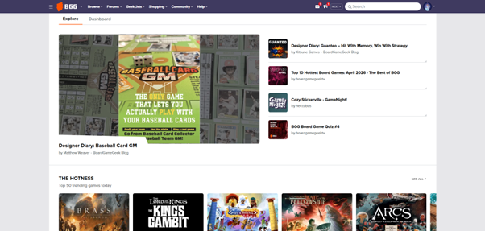 
*Figure 1: BGG Homescreen*

BoardGameGeek has extensive and [detailed documentation](https://boardgamegeek.com/wiki/page/Guide_To_BoardGameGeek) of all features on their wiki. The main focus for Meeplewood is collection management and tracking play sessions and will be analysed in more detail.

#### Collection Management

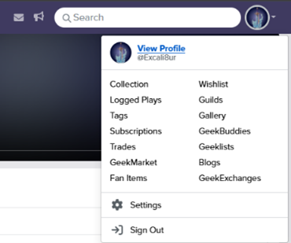 
*Figure 2: BGG Profile options*

The main page starts with a dashboard containing information about latest news and blogs, the best ("Hotness") and newest games. This is public information and is visible without an account.

When an account is created and the user is signed in, an icon displaying the user's chosen avatar provides access to several quick options in the upper-right corner on the BoardGameGeek website. Selecting this icon opens a small menu with shortcuts to profile-related actions (Figure 2).

The option "View Profile" in this quick access menu leads to a profile overview page that contains additional tabs and user-specific information (Figure 3). For this project, only the "Games" and "Statistics" tab is reviewed.

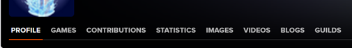 
*Figure 3: BGG Tabs on the profile-page*

When selecting the "Statistics" tab, the interface presents a list of available options rather than a direct overview (Figure 4). Most of these options lead to filtered views that closely resemble the collection view, but with different preselected filter settings applied. Some options, however, provide alternative representations of the data. For example, selecting "Games Owned By Year" (Figure 5) results in a different view that organises the collection based on temporal distribution.

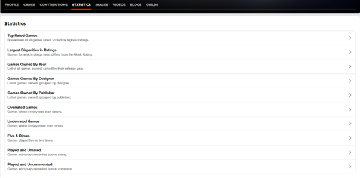 
*Figure 4: BGG Profile page "Statistics"-tab*

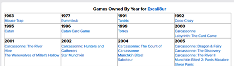 
*Figure 5: BGG Games owned by year*

The "Games" tab (Figure 6) under the user profile provides an overview of the user's board game collection, which allows the user to have a quick overview of their collection, but doesn't provide detailed information. When selecting one of the options, it does lead to the same collection view as the "Collection" link from the quick access menu, adding to the flexibility of use for users. Especially since this route is also usable if one likes to see collections of other users.

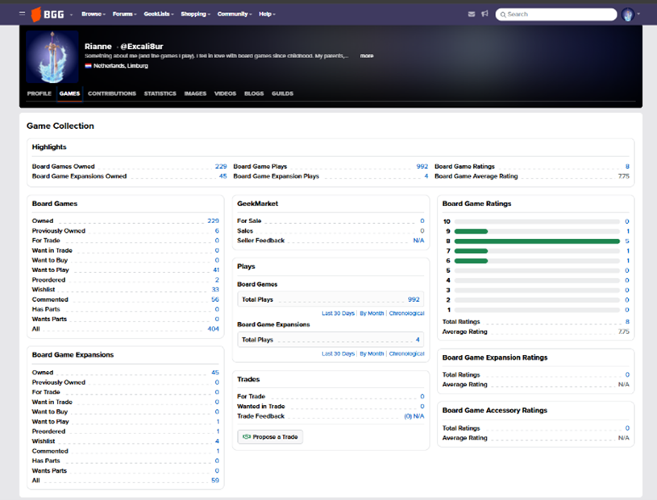 
*Figure 6: Profile page "games"-tab*

When selecting "Owned" from the Games-tab or "Collection" directly from the quick access menu, the collection view is shown. This presents a long, table-based list containing game titles, versions, user ratings, BoardGameGeek ratings, ownership status, number of plays, and personal comments (Figure 7). The wishlist view uses a similar structure but includes game images instead of a text-only list and provides less detailed information than the collection view (Figure 8).

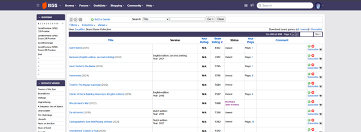 
*Figure 7: Main 'Collection' page*

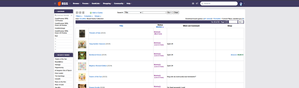 
*Figure 8: Wish-list view*

From a usability perspective, neither view offers an efficient overview of a user's collection. The collection view is highly data-dense and primarily text-based, making it difficult to quickly understand the composition of the collection and includes all games in the collection, including the whish-list items and previously owned items. The wishlist view improves visual recognition by including images, but still lacks structured filtering or summarisation that would help users identify patterns or categories within their games. As a result, it requires considerable effort for users to determine what types of games are present in a collection or wishlist, limiting the effectiveness of these views for quick analysis or exploration.

### Spiel-preview

[Spiel] is the largest board game convention in the world and is held in Oktober every year in the Messe halls in Essen for four days. According to their own information, nearly 1000 exhibitors from over 50 countries are showcasing over 1700 new game releases. The event hosts over 220000 visitors and runs over four days. It is a growing event and is still expanding. The fair ground is divided into several halls. In 2025, seven of the available halls were used, in 2026 the eighth hall will be opened for the first time.

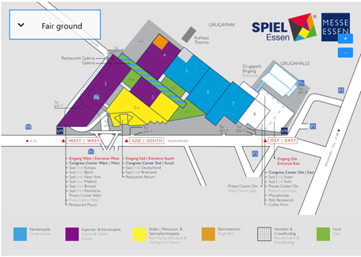 
*Figure 9: Spiel hall plan 2025*

Even a four-day duration is insufficient to explore every stand and game presented at the convention. Exhibitors start announcing upcoming releases around July by gradually adding them to a dedicated ["Spiel Preview"][SpielPreview] geek list on BoardGameGeek. This list functions as a central overview of games expected to be showcased at the convention, enabling users to browse upcoming titles and indicate their level of interest (Figure 10) and helping attendees to prioritise which games to explore or ignore during the event. The list is not exhaustive, as inclusion depends entirely on whether a publisher or designer chooses to add a game to the list.

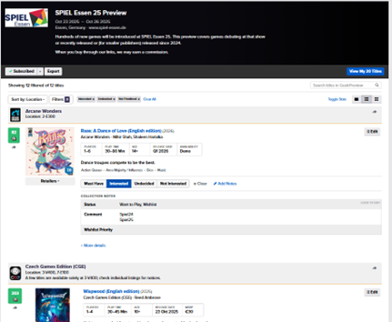 
*Figure 10: Spiel-preview 2025*

Furthermore, the development status of listed games varies significantly. Some titles are commercially available for purchase during the convention, whereas others are in a prototype or demonstration phase. Games in the latter category often reappear across multiple years, for example because they are still in development, seeking publication or are commercial released.

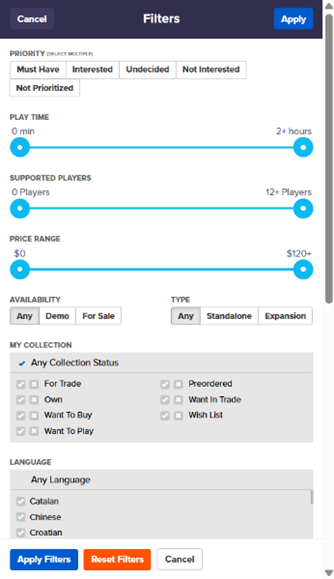 
*Figure 11: Spiel-previewlist filter options*

One of the ways the prioritisation is used, is by categorising games as either "Undecided" or "Not Interested." Titles marked as "Undecided" can then be reviewed in greater detail and assigned a higher of lower priority if warranted.

In addition to prioritisation, users can attach notes to individual games. These notes may be added either as public preview notes or as private notes when a game is saved to the personal wish list. Such notes can be useful for recording why a game appears interesting or why it has been marked as "Not Interested."

The list can be exported as a CSV file. This export includes personal priority settings and geek-preview comments, but excludes collection status and wish list comments.

## BGStats

Play sessions can be logged directly on the BoardGameGeek website; however, this process is not particularly mobile-friendly or convenient for use during or immediately after gameplay. As a result, several (mobile) applications have emerged as alternatives for recording play sessions. Among these, [BGStats] is one of the most widely used applications, offering a broad range of features and the ability to synchronise data with a BGG account.

One of the main strengths of BGStats is the speed and convenience with which new play sessions can be recorded. Sessions can be added quickly, even when offline, making the application especially practical during game nights or conventions.

The app allows users to include extensive details such as actual playtime, variants or expansions used, comments, images and the specific colour / role played by each participant. This creates a more complete and informative play history.

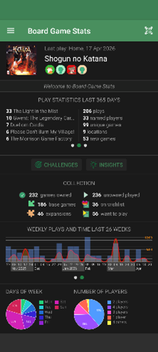
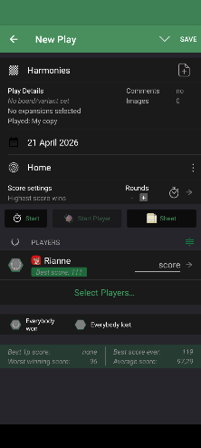
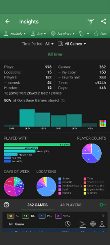
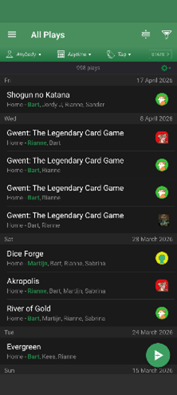 
*Figure 12: BGStats Screenshots*

Another important advantage is the range of insights generated from logged data. The application can show who wins the most games, when a particular title was last played, how many games were played within a month, year or custom date range and what the highest score for a specific game was. It can also identify games in a collection that have not yet been played, as well as games that have only been played once. Furthermore, the app provides a convenient overview of collection status, which can be particularly useful during events such as Spiel when reviewing wish list titles. The application is also actively maintained, with new features being introduced on a regular basis.

Despite these strengths, BGStats also has limitations. The statistical visualisations in particular are basic, often consisting of separate graphs that do not combine multiple data points into a single, more comprehensive dashboard.

In addition, many features are not immediately visible and are often overlooked. This may reduce usability, particularly for new users or those seeking quick access to advanced functions.

## Design Ideas

- Theme
- Overall look -and-feel

## Use case model

TODO: Need to add use case model (if needed)

### UC_Data01

| **Use Case​** | UC_Data01: Upload Data |
| --- | --- |
| **Description**​ | Upload new data to the collection |
| **Actors**​ | Datamanager |
| **Trigger**​ | New data available to add |
| **Pre-conditions**​ | - |
| **Post-conditions**​ | Data added to the collection and visible in the collection overview. |
| **Steps**​ | <steps that (can) be performed during the use case.  Left = actions from the actor; right = actions from the system>​ |
| 1. ​ 3.​ 4.​ …​ | 2.​ 5. ​ |
| **Main Succes Scenario**​ | <sequence of steps for the most important (most common) successful scenario> |
| **Alternative Scenario's**​ | <sequence of steps for all other scenarios; each time give a name for the scenario and whether it is successful or not>​ |

#### Lo-Fi Prototype UC_Data01

*Not sure yet if prototypes per uc will be added.*

## References

- [MeepleWood Github repository][GitRepo]: https://github.com/Excali8ur/Meeplewood

[GitRepo]:https://github.com/Excali8ur/Meeplewood

- [Cross], L., Piovesan, A., Sousa, M., Wright, P., & Atherton, G. (2023). Your move: An open access dataset of over 1500 board gamer's demographics, preferences and motivations. *Simulation & Gaming*, 54(5)_, pp. 554-575.

[Cross]:https://www.researchgate.net/publication/372672418_Your_Move_An_Open_Access_Dataset_of_Over_1500_Board_Gamer's_Demographics_Preferences_and_Motivations

- [Woodward], P., & Woodward, S. (2019, Oktober). Mining the Boardgamegeek. *Significance*, pp. 24-29.

[Woodward]: https://rss.onlinelibrary.wiley.com/doi/full/10.1111/j.1740-9713.2019.01317.x

- [Xiao], T. (2025). Analysis of Factors Influencing Board Game Ownership Based on A Gradient Boosting Model. *Theoretical and Natural Science*, pp. 16-24.

[Xiao]: https://www.researchgate.net/publication/394369091_Analysis_of_Factors_Influencing_Board_Game_Ownership_Based_on_A_Gradient_Boosting_Model

[LinkedIn]:https://www.linkedin.com/in/rianneverheijen
[BGG]: https://boardgamegeek.com/
[BGStats]:https://www.bgstatsapp.com/
[Spiel]:https://www.spiel-essen.de/en/
[SpielPreview]:https://boardgamegeek.com/geekpreview/78/spiel-essen-25-preview
[GenCon]:https://www.gencon.com/