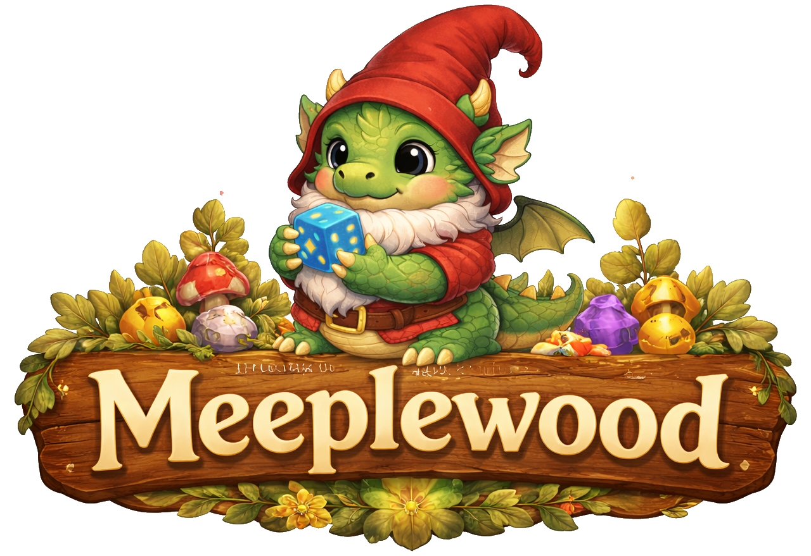

# Software Architecture

## Table of Contents

- [Introduction](#introduction)
- [Used Frameworks](#used-frameworks)
- [System Architecture Overview](#system-architecture-overview)
- [Component Diagram](#component-diagram)
- [Class diagram](#class-diagram)
- [Interface design](#interface-design)
- [References](#references)
- [Appendix I: Chatlogs CoPilot](#appendix-i-chatlogs-copilot)

---

## Introduction

## Used Frameworks

*AI helped setting up the basics and to explain it.*

### Understanding Next.js and Tailwind

- https://medium.com/@elanaolson/a-beginners-guide-to-building-a-react-nextjs-app-7463120389f0
- https://nextjs.org/docs/app/getting-started/project-structure
- https://nextjs.org/docs/pages/building-your-application/routing/pages-and-layouts

## System Architecture Overview

## Component Diagram

- Purpose and responsibilities
- Input and output specifications
- Algorithms and processing logic
- Dependencies on other components or external systems

## Class diagram

- If useful

## Interface design

- API specifications and protocols
- Message formats and data structures
- How errors and exceptions will be handled
- Security and authentication methods

## References

- BoardGameGeek. (n.d.). Retrieved from https://boardgamegeek.com/
- Boumans, R. (2026). Github repository. Retrieved from https://github.com/Excali8ur/Meeplewood
- Cross, L., Piovesan, A., Sousa, M., Wright, P., & Atherton, G. (2023). *Your move: An open access dataset of over 1500 board gamer’s demographics, preferences and motivations.* Simulation & Gaming, 54(5), pp. 554-575.
- Eerko. (n.d.). Board Game Stats. Retrieved from https://www.bgstatsapp.com/
- Gen Con. (n.d.). Retrieved from https://www.gencon.com/
- LinkedIn. (n.d.). Retrieved from https://www.linkedin.com/in/rianneverheijen/
- Spiel. (n.d.). Retrieved from https://www.spiel-essen.de/en/
- Woodward, P., & Woodward, S. (2019, October). *Mining the Boardgamegeek.* Significance, pp. 24-29.
- Xiao, T. (2025). *Analysis of Factors Influencing Board Game Ownership Based on A Gradient Boosting Model.* Theoretical and Natural Science, pp. 16-24.
