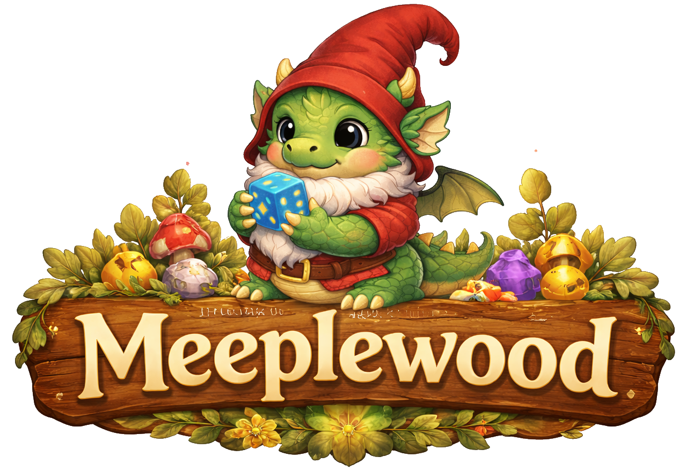

# Data Visualisation

## Table of Contents

- [Introduction](#introduction)
- [Project Overview & Motivation](#project-overview--motivation)
- [Data abstraction](#data-abstraction)
- [Visual Encoding](#visual-encoding)
- [References](#references)

## Introduction

## Project Overview & Motivation

## Data abstraction

### Data Sources and structure

The data is split in several dynamic datasets. The data is converted from manually exported or collected data from different sources.

### Logged plays

Play sessions are logged via BGStats, which is automatically synchronized with a BGG account. An export can be made directly from the BoardGameGeek website, this is however limited to a certain amount of records. From an [external tool](http://www.sheltonsonline.net/bggtools/getplays), the data can be retrieved per user with a few clicks. This export has the following naming structure:

`<username>-plays-<date retrieved>.csv`

For the following explanation and range description, the export `excali8ur-plays-2025-03-23.csv` is used. Content will vary a lot, depending on how (in)complete an user is logging their sessions.

| Column name | Datatype | Range | Description |
| --- | --- | --- | --- |
| play ID | Integer (unique) | 60623503 - 96946840 | It is an unique number, probably autoincremented for every logged play on BGG. |
| game ID | Integer | 45 - 432 | Unique board game identifier from BGG. |
| game name | Text | up to 37 chars | Name of the board game that was played. |
| date | Date | 01/01/2008 - 31/12/2024 | Play date stored as DD/MM/YYYY text. |
| location | Text | up to 20 chars | Location where the game was played. Over the years, the values changed ('Home' was previously shown as 'H.') |
| length | Float | 10.0 - 480.0 | Duration of the play in minutes. |
| comments | Text | up to 713 chars | Optional free-text notes about the play session. |
| player 1 username | Text | up to 11 chars | BGG username of player when linked to an account. |
| player 1 name | Text | up to 22 chars | Display name of player 1. |
| player 1 startposition | Integer | 1 - 8 | Starting position or turn order of player 1. |
| player 1 color | Text | up to 10 chars | Color assigned to player 1 in the game. |
| player 1 score | Integer | -9 - 336 | Numeric score for player 1. |
| player 1 new | Float | Binary flag (1=yes) | Indicating whether this was the first time player 1 played this game. |
| player 1 win | Boolean | Binary flag (1=yes). | Indicating whether player 1 won the game. |

The columns "player 1 username" till "player 1 win" are repeated for player 2 to player 8.

This data is however limited and not easy to retreive. An export from BGStats is also possible as a json file. This file is easy to export and contains more information. The BGStats export is therefor the preffered data source for logged plays.

The file `data/BGStatsExport.json` is a nested JSON object. The following tables describes per main collection the data.

//| Collection | Records | Main fields | Description |

#### Tags

| Column name | Datatype | Range | Description |
| --- | ---: | --- | --- |
| uuid | | | |
| id | | | |
| name | | | |
| type | | | |
| group | | | |
| status flags | | | |
| modificationDate | | | |
Labels that can be assigned to games or plays.

#### Groups
| Column name | Datatype | Range | Description |
| --- | ---: | --- | --- |
| uuid | | | |
| id | | | |
| name | | | |
| type | | | |
| status flags | | | |
| metaData | | | |
Saved BGStats filters and collections, such as owned, wishlist and played games.

#### Players
| Column name | Datatype | Range | Description |
| --- | ---: | --- | --- |
| uuid | | | |
| id | | | |
| name | | | |
| isAnonymous | | | |
| bggUsername | | | |
| metaData | | | |
People and anonymous or non-player participants that can occur in play records.

#### Locations
| Column name | Datatype | Range | Description |
| --- | ---: | --- | --- |
| uuid | | | |
| id | | | |
| name | | | |
| modificationDate | | | |
| metaData | | | |
Places where a play session took place.

#### Games
| Column name | Datatype | Range | Description |
| --- | ---: | --- | --- |
| identity | | | |
| BGG data | | | |
| play characteristics | | | |
| rating | | | |
| copies | | | |
| tags | | | |
Board games and expansions, including player-count, duration, age, images, designers and collection information. Each game can contain one or more collection copies.

#### Games[].copies
| Column name | Datatype | Range | Description |
| --- | ---: | --- | --- |
| variable | | | |
| collection status flags | | | |
| edition data | | | |
| bggCollId | | | |
| versionName | | | |
| metaData | | | |
Individual owned, wished-for or previously owned copies or editions of a game.

#### Plays
| dates | | | |
| durationMin | | | |
| bggId | | | |
| locationRefId | | | |
| gameRefId | | | |
| comments | | | |
| rating, playerScores | | | |
| expansionPlays | | | |
Logged game sessions. References connect each play to a game and location.

#### Plays[].playerScores
| Column name | Datatype | Range | Description |
| --- | ---: | --- | --- |
| variable | | | |
| score | | | |
| winner | | | |
| newPlayer | | | |
| playerRefId | | | |
| rank | | | |
| seatOrder | | | |
| team | | | |
| startPosition | | | |
Player-specific results and participation details for a play.

#### Plays[].expansionPlays
| Column name | Datatype | Range | Description |
| --- | ---: | --- | --- |
| variable | | | |
| gameRefId | | | |
| bggId | | | |
| metaData | | | |
Expansions used during a play session.

#### Challenges
| Column name | Datatype | Range | Description |
| --- | ---: | --- | --- |
| name | | | |
| type | | | |
| dates | | | |
| completion fields | | | |
| playerUuids, games | | | |
BGStats challenges, including their period, target values, participants and included games.

challenges[].games
| gameRefId, dontInclude | Games included in or excluded from a challenge. |
|
deletedObjects
| uuid | | | |
| objectType | | | |
| externalId | | | |
| modificationDate, lastCloudSync | | | |
Records deleted in BGStats but retained so synchronisation can be tracked.

userInfo
| meRefId | | | |
| bggUsername | | | |
| exportDate | | | |
| appVersion | | | |
| systemVersion | | | |
| device | | | |
Information about the account, export and device that produced the file.

uuid values identify records globally, while id values identify records within BGStats. Fields ending in RefId refer to another collection, for example plays.gameRefId refers to games.id and plays.locationRefId refers to locations.id. The metaData fields contain additional JSON stored as text and may differ between records.

## Visual Encoding

## References

- Board Game Plays Export. (n.d.). Retrieved from http://www.sheltonsonline.net/bggtools/getplays

- BoardGameGeek. (n.d.). Retrieved from [https://boardgamegeek.com/

- Boumans, R. (2026). Github repository. Retrieved from https://github.com/Excali8ur/Meeplewood]

- Eerko. (n.d.). Board Game Stats. Retrieved from [https://www.bgstatsapp.com/]

- Gen Con. (n.d.). Retrieved from https://www.gencon.com/

- Spiel. (n.d.). Retrieved from https://www.spiel-essen.de/en/